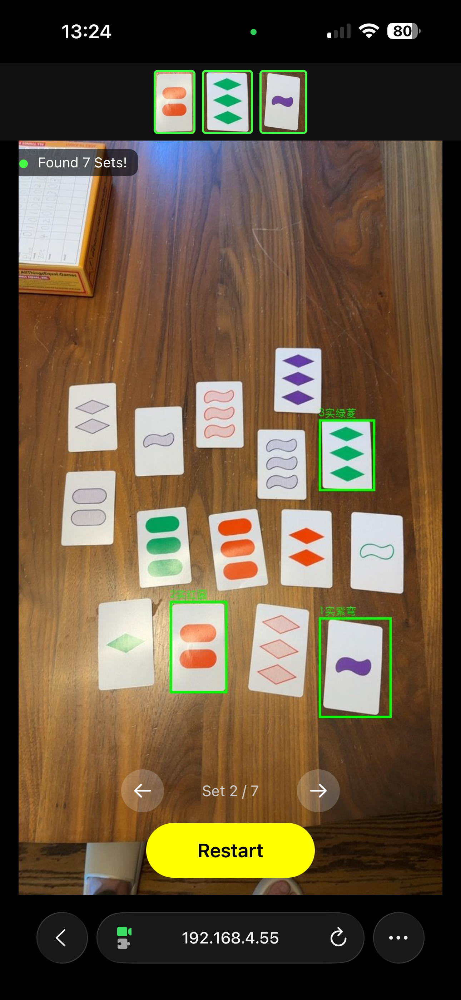

# Set Solver 🃏

Vision-based solver for the [Set card game](https://www.setgame.com/).

Take a photo of Set cards → Get all valid Sets highlighted.



**[Try the live demo](https://huggingface.co/spaces/wangtianthu/set-solver)** | **[Download models](https://huggingface.co/wangtianthu/set-solver-models)**

## Features

- ✅ **Card Detection** - YOLOv11n detector (99.5% mAP50)
- ✅ **Card Classification** - MobileNetV3 classifier (100% accuracy)
- ✅ **Set Finding** - Efficient combinatorial solver
- ✅ **Synthetic Data** - Realistic board generator with:
  - Multiple background textures (wood, marble, gradients)
  - Perspective transforms (camera angle simulation)
  - Noise objects (buttons, coins, paper clips)
  - Variable card counts (9-12 cards)

## Quick Start

```bash
# Setup
python -m venv .venv
source .venv/bin/activate
pip install -r requirements.txt

# Run on any image
python -m src.inference.solve photo.jpg -o result.jpg --show

# Options
python -m src.inference.solve photo.jpg \
  --output result.jpg \   # save annotated output
  --conf 0.25 \           # detection confidence threshold (default: 0.25)
  --show                  # open result in image viewer
```

## Live Camera Web App

A real-time web interface that uses your camera to scan for Sets continuously.

```bash
# Install web dependencies (not in requirements.txt)
pip install fastapi uvicorn python-multipart

# Start the server
python -m src.web.app
# → Open http://localhost:8000 in your browser
```

The web app will:
- Request camera access (prefers rear camera on mobile)
- Press **Start** (or spacebar) to begin scanning at ~3 fps
- Automatically stop and announce "Set!" when valid Sets are found
- Show annotated results with color-coded bounding boxes
- Press **Start** again (or spacebar) to restart scanning

## Model Performance

| Model | Metric | Value |
|-------|--------|-------|
| Detector (YOLOv11n) | mAP50 | 99.5% |
| Detector (YOLOv11n) | mAP50-95 | 97.4% |
| Classifier (MobileNetV3) | Accuracy | 100% |

Trained on 1000 synthetic board images with realistic augmentations.

## Training Pipeline

**Models are saved to `~/data/set-solver/weights/`** (outside repo for safety).

### 1. Train Classifier
```bash
python -m src.train.classifier
# Time: ~5-10 min (30 epochs)
# Output: ~/data/set-solver/weights/classifier_best.pt
# Data: training_images/ (real card photos, 81 classes)
```

### 2. Generate Synthetic Boards
```bash
python -m src.generate.board_generator --num 1000 --layout grid
# Time: ~2-3 min
# Output: data/synthetic/ with YOLO-format annotations
```

### 3. Train Detector
```bash
python -m src.train.detector --epochs 10
# Time: ~8-10 min on MPS (Apple Silicon), ~15-20 min on CPU
# Output: ~/data/set-solver/weights/detector/weights/best.pt
# Data: data/synthetic/ (generated boards)
```

### 4. Generate Showcase
```bash
python scripts/generate_showcase.py --samples 8
# → showcase.html with detection visualizations
```

## How It Works

1. **Detect** cards using YOLOv11 object detection
2. **Classify** each card's 4 attributes (shape, color, number, fill)
3. **Solve** by finding all valid Sets
4. **Visualize** results with color-coded bounding boxes

## Set Card Properties

| Attribute | Values |
|-----------|--------|
| Shape | Diamond, Oval, Squiggle |
| Color | Red, Green, Purple |
| Number | 1, 2, 3 |
| Fill | Solid, Striped, Empty |

A valid **Set** requires each attribute to be either:
- All the same across 3 cards, OR
- All different across 3 cards

Total unique cards: 3^4 = **81**

## Project Structure

```
set-solver/
├── src/
│   ├── train/          # Training scripts
│   ├── generate/       # Synthetic data generation
│   ├── inference/      # Solving pipeline (CLI)
│   └── web/            # Live camera web app (FastAPI)
├── scripts/            # Utilities
├── weights/            # Trained models
├── data/
│   ├── synthetic/      # Generated training data
│   ├── backgrounds/    # Table textures
│   └── noise_objects/  # Distractor objects
└── training_images/    # Raw card images
```

## License

MIT
